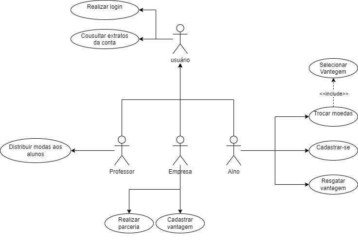

<h1 align="center">:file_cabinet: Laboratório de Desenvolvimento de Software</h1>

## :memo: Alunos:

- Ana Carolina de Carvalho Corrêa
- Henrique Pinto Santos
- Gabriel Pimentel Tabatinga

## :books: Funcionalidades

- <b>Funcionalidades</b>: Loading...

## :wrench: Tecnologias utilizadas

- Java;

## :rocket: Lab02S01:

Diagrama de Caso de Uso:  

Diagrama de Classes:  

 

## :dart: Professor:

Danilo Boechat Seufitelli
