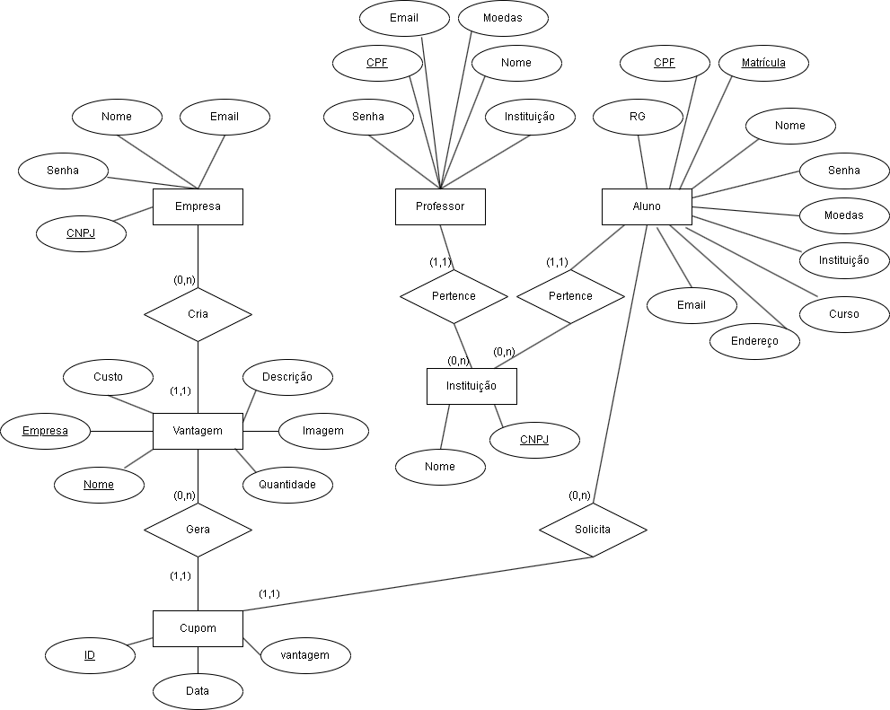

<h1 align="center">:file_cabinet: Laboratório de Desenvolvimento de Software</h1>

## :memo: Alunos:

- Ana Carolina de Carvalho Corrêa
- Henrique Pinto Santos
- Gabriel Pimentel Tabatinga

## :books: Funcionalidades

- <b>Funcionalidades</b>: Loading...

## :wrench: Tecnologias utilizadas

- Java;

## :rocket: Lab02S01:

Diagrama de Caso de Uso:  

Diagrama de Classes:  

 

Diagrama de Entidade e Relacionamento:  

 

Histórios de Usuário:

Eu me chamo Marcio, e sou aluno de filosofia da PUC, gosto de ler livros. Desejo poder realizar meu cadastro no sistema de mérito, para ser reconhecido por meu bom comportamento, minha participação em aula, etc.

Eu me chamo Lúcia, e sou aluna de artes plásticas na UEMG, gosto de desenhar e pintar. Desejo poder resgatar vantagens.

Eu me chamo Jorge, e sou aluno de direito da PUC, gosto de ver série. Desejo poder trocar minha moedas por vantagens, e quando for fazer isso, desejo selecionar qual vantagem irei querer.

Eu me chamo Bárbara, e sou professora da UFMG, gosto de ver filmes de romance. Desejo poder distribuir reconhecimento aos meus alunos por meio de moedas para os alunos que merecem.

Eu me chamo Débora, e gosto de correr ao ar livre. Desejo poder realizar login na plataforma.

Eu me chamo Sandra, e gosto de ir no teatro. Desejo poder consultar estratos da minha conta de moedas.

Eu me chamo Katy, e trabalho em uma empresa parceira do sistema, gosto de jogar videogame. Desejo poder realizar o cadastro de vantagens no sistema de mérito.

Eu me chamo Diego,  e trabalho em uma empresa parceira do sistema, gosto de tirar fotos de borboletas. Desejo poder realizar parcerias, incluindo as vantagens que desejo oferecer e o custo de cada uma delas em moedas.

## :dart: Professor:

Danilo Boechat Seufitelli

